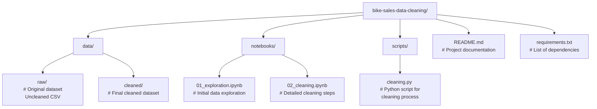

# 🛠️ Bike Sales Data Cleaning Project

This project focuses on **data cleaning and preprocessing** of a raw bike sales dataset. The dataset contained inconsistencies, missing values, and formatting issues that were addressed systematically to prepare it for further **data analysis and visualization**.

The cleaning process was performed using **Python (pandas, numpy)**.

---

## 📂 Dataset Overview

- **Initial Shape**: `(89, 16)`  
- **Final Shape**: `(86, 16)`

### Columns:
`Sales_Order #`, `Date`, `Day`, `Month`, `Year`, `Customer_Age`, `Age_Group`,  
`Customer_Gender`, `Country`, `State`, `Product_Category`, `Sub_Category`,  
`Product_Description`, `Order_Quantity`, `Unit_Cost`, `Unit_Price`, `Profit`,  
`Cost`, `Revenue`

---

## 🧹 Cleaning Steps

### 1. Date and Time Standardization
- Converted **`Date`** column to proper `datetime` format.  
- Performed **cross-field validation** between `Date`, `Day`, `Month`, and `Year` to ensure consistency.  
- Dropped/Corrected inconsistent rows after validation (reduced from 89 → 86 rows).

---

### 2. Handling Month Column
- Found **inconsistent month names** (misspellings, capitalization issues).  
- Normalized month values to proper format.  
- Mapped month names to **integer values (1–12)**.

---

### 3. String Cleaning
- Stripped extra spaces from column names (e.g., `' Unit_Cost '` → `Unit_Cost`).  
- Trimmed leading/trailing spaces in categorical fields like `Product_Description`, `Sub_Category`, and `State`.

---

### 4. Categorical Validation
- Ensured `Age_Group` matched corresponding `Customer_Age`.  
- Standardized `Customer_Gender` values (e.g., "M" → "Male", "F" → "Female").  
- Cleaned inconsistencies in **Country and State names** (removed typos, duplicates).

---

### 5. Numerical Columns Cleaning
- Converted financial columns (`Unit_Cost`, `Unit_Price`, `Profit`, `Cost`, `Revenue`) to **numeric**.  
- Checked and corrected relationships:  
  - `Revenue = Unit_Price × Order_Quantity`  
  - `Cost = Unit_Cost × Order_Quantity`  
  - `Profit = Revenue - Cost`

---

### 6. Duplicate & Missing Values
- Removed **duplicate rows**.  
- Checked for **missing values**:  
  - Dropped rows with missing key identifiers (e.g., `Sales_Order #`, `Date`).  
  - Filled numeric nulls with **0** or recomputed from related fields.

---

## ✅ Final Dataset
- Shape reduced from **(89,16) → (86,16)**.  
- Dates validated & standardized.  
- Numeric fields corrected.  
- Categorical fields cleaned & mapped.  
- Dataset is now **ready for analysis, visualization, and reporting**.

---

## ⚙️ Tools & Libraries
- Python  
- Pandas  
- NumPy  

---

## 🚀 Next Steps
With the cleaned dataset, possible next steps include:  
- Exploratory Data Analysis (EDA)  
- Sales trend analysis over time  
- Customer segmentation (age, gender, location)  
- Profitability insights by product category  

---

## 📜 Sample Code

```python
#converting to datetime format
df['Date']= pd.to_datetime(df['Date'])

#striffing to a custom format
df['Date']= df['Date'].dt.strftime('%Y-%m-%d')

#converting back to datetime format
df['Date']= pd.to_datetime(df['Date'])
---
#Option 1: cross field validation of Date||Day||Month||Year columns

#checking for validation
date_year= df['Year']==df['Date'].dt.year
date_month= df['Month']==df['Date'].dt.month
date_day= df['Day'].astype('int')==df['Date'].dt.day

#getting inconsistent and consistent ones
inconsistent_year = df[~date_year]
inconsistent_month = df[~date_month]
inconsistent_day = df[~date_day]
print(f'Inconsistency found are: {inconsistent_year.shape[0]} Years, {inconsistent_month.shape[0]} months, {inconsistent_day.shape[0]} days')

#getting consistent ones
consistent_year = df[date_year]
consistent_month = df[date_month]
consistent_day = df[date_day]
print(f'Consistent ones are: {consistent_year.shape[0]} Years, {consistent_month.shape[0]} months, {consistent_day.shape[0]} days')

consistent_df= df[date_day & date_month & date_year]

print(f'Final consistent data: {consistent_df.shape[0]}')

# Save cleaned dataset
df.to_csv("bike_sales_cleaned.csv", index=False)
---
- Inconsistency found are: 0 Years, 0 months, 0 days
- Consistent ones are: 89 Years, 89 months, 89 days
- Final consistent data: 89
---
#Option 2: confirming cross field validation of consistent value data frame

#option 1: finding the original cost, revenue and profit diffrences
cost_cfv= consistent_df['Order_Quantity'] * consistent_df['Unit_Cost']
price_cfv= consistent_df['Order_Quantity'] * consistent_df['Unit_Price']
diffrences= consistent_df['Revenue'] - consistent_df['Cost']

#option 2: Comparing
comparing_cost_cfv= cost_cfv == consistent_df['Cost']
comparing_price_cfv= price_cfv == consistent_df['Revenue']
profit_comp= diffrences == consistent_df['Profit']

#option 3: getting inconsistent data
inconsistent_cost= consistent_df[~comparing_cost_cfv]
inconsistent_price= consistent_df[~comparing_price_cfv]
inconsistent_diffrences= consistent_df[~profit_comp]
print(f'Inconsistency found are: {inconsistent_cost.shape[0]} cost, {inconsistent_price.shape[0]} price, {inconsistent_diffrences.shape[0]} profit_diffrences')

#option 4: getting consistent data
consistent_cost= consistent_df[comparing_cost_cfv]
consistent_price= consistent_df[comparing_price_cfv]
consistent_diffrences= consistent_df[profit_comp]
print(f'Consistency found are: {consistent_cost.shape[0]} cost, {consistent_price.shape[0]} price, {consistent_diffrences.shape[0]} profit_diffrences')

#option 5: concating the consistent values into a final dataframe
over_final_cons= consistent_df[comparing_cost_cfv & comparing_price_cfv & profit_comp]
print(f'Final consistent data: {over_final_cons.shape[0]}')
```

